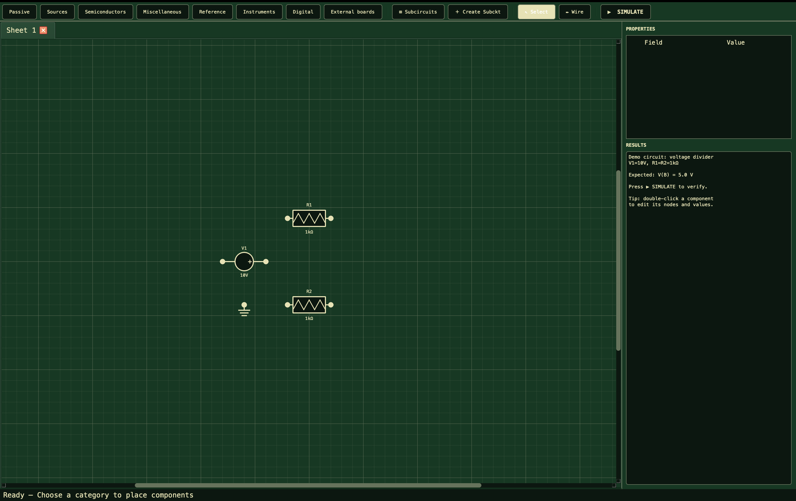

# OhmPy

**Open-source electronic circuit simulator — analog, digital, and mixed-signal.**

[Architecture guide](docs/architecture.md)

OhmPy is a schematic-capture and simulation environment built with Python + PyQt6. Its custom MNA (Modified Nodal Analysis) engine solves DC, AC, and transient analyses from the same netlist, with virtual instruments (a multimeter, two-channel oscilloscope, and function generator) integrated into the canvas.



---

## Features

### Simulation engine

- **DC analysis** — linear and nonlinear (Newton–Raphson), with source stepping for circuits containing diodes, LEDs, BJTs, MOSFETs, and op-amps.
- **AC analysis** — frequency sweeps with cached LU factorization at each frequency point.
- **Transient analysis** — adaptive time steps with LTE error control for linear and nonlinear analog circuits.
- **Digital engine** — event-driven binary simulation with propagation delays.
- **Mixed signal** — internal bridges couple shared analog and digital nodes during co-simulation.

### Components available from the editor

| Category | Components |
|---|---|
| Passive | Resistor, potentiometer, capacitor, inductor, generic impedance |
| Sources | DC voltage, AC voltage, current, function generator |
| Semiconductors | Diode, LED (color-specific Vf), NPN/PNP BJT, N/P MOSFET, ideal op-amp, dual TL082 |
| Converters | Ideal transformer, diode bridge rectifier |
| Digital | AND, OR, NOT, NAND, NOR, XOR, DFF, JKFF, TFF, SRFF, binary counter, 2:1 MUX, NE555, logic state and clock |
| Mixed signal | Automatic internal CMOS-level bridges; ADC/DAC are not canvas components |

The engine API additionally exposes digital models such as XNOR, buffers,
registers, memories and standalone A/D bridge classes. They are not all wired
into the schematic editor.

### Virtual instruments

- **Multimeter** — DC/AC voltage, current and resistance readings between two schematic pins.
- **Oscilloscope** — two differential channels with configurable time base and vertical scale; it can also read the optional serial hardware stream.
- **Function generator** — sine, square and triangle waveforms with amplitude, frequency and offset controls.

### Additional tools

- **Digital circuit analyzer** — truth tables, SOP/POS minimization and automatic construction of a gate circuit.
- **Resistor calculator** — color code ↔ value conversion and E12/E24/E96 series.
- **Power triangle** — P, Q, S, and power factor for AC analysis.
- **Themes** — support for customizable JSON themes. See [`themes/README.md`](themes/README.md) to create your own.

---

## Installation

**Requirements:** Python 3.10 or later; Windows, Linux, or macOS.

```bash
git clone https://github.com/pabdan2003/OhmPy.git OhmPy
cd OhmPy
python -m venv .venv
# Windows
.venv\Scripts\activate
# Linux/macOS
source .venv/bin/activate
pip install -r requirements.txt
python main.py
```

### macOS application

To create the distributable macOS application, install the optional build
tool and run:

```bash
python -m pip install ".[build]"
sh scripts/build_macos.sh
```

This produces `dist/OhmPy.app` and `dist/OhmPy-<version>-macOS.dmg`. Distribute
the DMG and ask users to drag **OhmPy.app** to **Applications**. For each new
release, build it with an increased `version` in `pyproject.toml`; replacing
the existing app in Applications updates it in place, without duplicating the
application. User preferences and custom themes remain in `~/.ohmpy`.

Before distributing outside a small trusted group, sign and notarize the app
with an Apple Developer certificate; otherwise macOS will show a security
warning on first launch.

## Downloads

| Platform | Status | Download |
| --- | --- | --- |
| macOS (Apple Silicon) | Available | [Latest release](https://github.com/pabdan2003/OhmPy/releases/latest) |
| Windows | Coming soon | — |
| Linux | Coming soon | — |

For macOS, download the `.dmg` asset from the release, open it, and drag
**OhmPy.app** to **Applications**. The current build is for Apple Silicon
(M1, M2, M3, M4, or M5); an Intel macOS build is not available yet.

---

## Quick start

1. Start OhmPy with `python main.py`.
2. Drag components from the side panel onto the canvas.
3. Connect pins by clicking one pin and then another.
4. Double-click a component to edit its value.
5. Click **▶ SIMULATE**; OhmPy automatically detects DC, AC, digital, or mixed-signal mode.

### Minimal example (engine from Python)

```python
from ohmpy.engine import Resistor, VoltageSource, MNASolver

solver = MNASolver()
circuit = [
    VoltageSource("V1", "in", "0", 10.0),
    Resistor("R1", "in", "out", 1000.0),
    Resistor("R2", "out", "0", 1000.0),
]
result = solver.solve_dc(circuit)
print(result["voltages"]["out"])  # 5.0 V
```

---

## Project structure

```
OhmPy/
├── main.py                  # Entrypoint (opens the main window)
├── ohmpy/                  # Main package
│   ├── circuit_analyzer.py  # Simulation-mode classification and mixed-boundary detection
│   ├── theme_manager.py     # Theme loading and persistence
│   ├── engine/
│   │   ├── mna.py           # MNA solver (DC, AC, transient)
│   │   ├── components.py    # Analog component models
│   │   ├── digital_engine.py# Event-driven digital simulator
│   │   ├── bridges.py       # Analog ↔ digital converters
│   │   └── mixed_signal.py  # Mixed-signal simulation coordinator
│   └── ui/
│       ├── scene.py         # QGraphics scene and netlist construction
│       ├── items/           # ComponentItem, WireItem
│       ├── dialogs/         # Instruments and configuration dialogs
│       └── style.py         # Theme, fonts, and visual constants
├── themes/                  # JSON themes (data)
├── firmware/                # Protocol and firmware examples for a physical probe
└── tests/                   # pytest suite (engine, mixed signal, and project I/O)
```

---

## Testing

```bash
pip install -r requirements-dev.txt
pytest -v
```

Pushes to `main` and pull requests run the suite on Python 3.10, 3.11 and 3.12 through GitHub Actions (see `.github/workflows/ci.yml`).

---

## Roadmap

- [x] Migrate tests to `pytest` + GitHub Actions CI.
- [x] Bode plots (magnitude and phase) for the existing AC analysis.
- [ ] FFT in the oscilloscope.
- [x] Limited SPICE-like `.net` export for basic two-terminal components.
- [ ] SPICE netlist import and compatibility validation with external simulators.
- [x] Reusable subcircuits (selection encapsulation).
- [x] Undo changes using snapshots.
- [ ] Redo and optional migration to `QUndoStack`.
- [ ] Orthogonal wire auto-routing.
- [ ] Persistent probes on the schematic.

---

## Contributing

Contributions are welcome. Before opening a pull request:

1. Read [`docs/architecture.md`](docs/architecture.md) to understand the separation between engines and global conventions (signs, units, node names).
2. Run the existing tests and add the ones relevant to your change.
3. For engine changes, include a validation case against a known analytical solution.
4. For visual changes, attach before-and-after screenshots.

Quick package maps:

- [`ohmpy/engine/README.md`](ohmpy/engine/README.md) — purpose of each engine file.
- [`ohmpy/ui/README.md`](ohmpy/ui/README.md) — purpose of each UI file.
- [`themes/README.md`](themes/README.md) — JSON theme format and how to create one.
- [`firmware/README.md`](firmware/README.md) — binary protocol for the physical oscilloscope probe.

---

## License

Distributed under the [MIT License](LICENSE).
