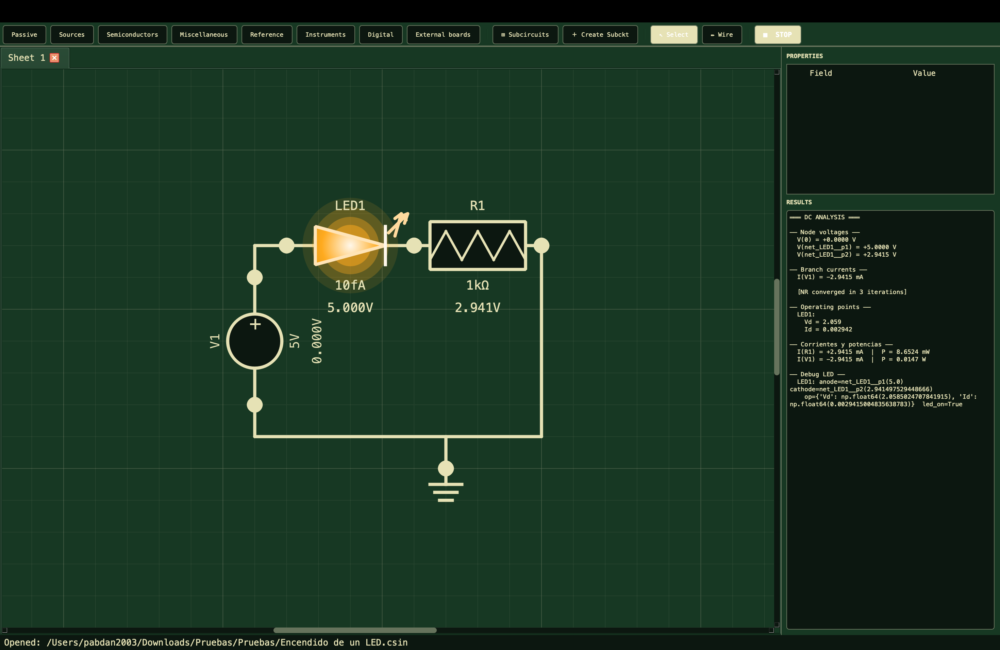
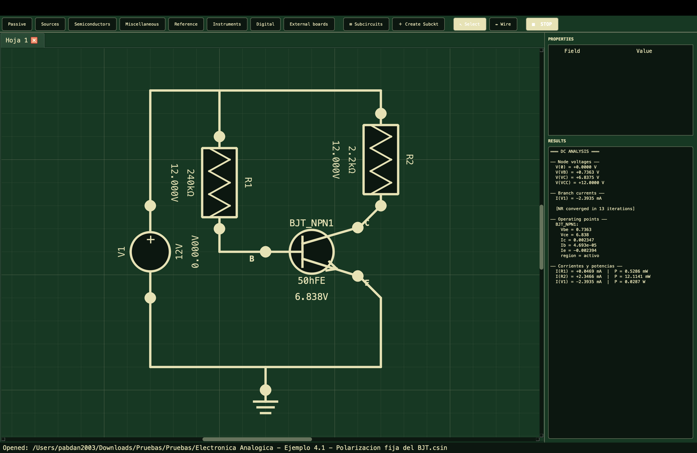
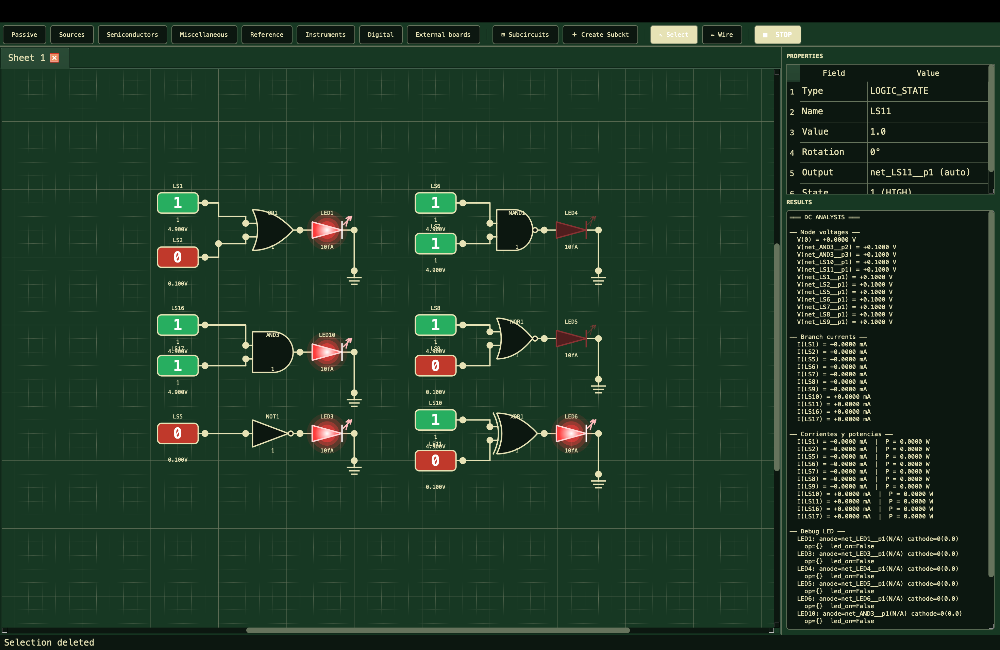
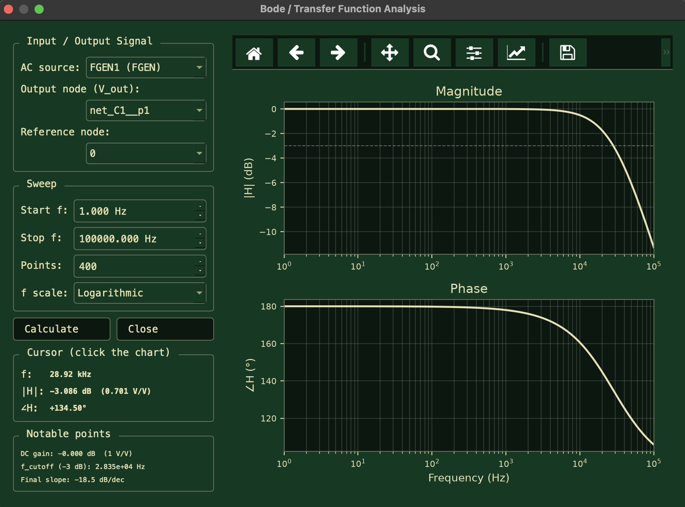

# Kirho

**Simulador de circuitos electrónicos open source — analógico, digital y señal mixta.**

[Read the English documentation in the project README](../README.md).

Kirho es un entorno de captura de esquemáticos y simulación construido en Python + PyQt6, con un motor MNA (Modified Nodal Analysis) propio que resuelve DC, AC y transitorios sobre el mismo netlist, e instrumentos virtuales (multímetro, osciloscopio de 2 canales y generador de funciones) integrados en el canvas.


---

## Características

### Motor de simulación

- **Análisis DC** — lineal y no-lineal (Newton-Raphson) con continuación de fuente para circuitos con diodos, LEDs, BJT, MOSFET y op-amps.
- **Análisis AC** — barrido en frecuencia con factorización LU cacheada por punto de frecuencia.
- **Análisis transitorio** — paso adaptativo con control de error LTE para circuitos analógicos lineales y no lineales.
- **Motor digital** — simulación binaria a eventos con retardos de propagación.
- **Señal mixta** — puentes internos acoplan nodos analógicos y digitales compartidos durante la co-simulación.

### Componentes disponibles desde el editor

| Categoría | Componentes |
|---|---|
| Pasivos | Resistor, Potenciómetro, Capacitor, Inductor, Impedancia genérica |
| Fuentes | Voltaje DC, Voltaje AC, Corriente, Generador de funciones |
| Semiconductores | Diodo, LED (Vf por color), BJT NPN/PNP, MOSFET N/P, Op-Amp ideal, TL082 dual |
| Conversores | Transformador ideal, Puente de diodos rectificador |
| Digital | AND, OR, NOT, NAND, NOR, XOR, DFF, JKFF, TFF, SRFF, contador binario, MUX 2:1, NE555, estado lógico y reloj |
| Señal mixta | Puentes CMOS internos automáticos; ADC/DAC no son componentes del canvas |

La API del motor expone además XNOR, buffers, registros, memorias y clases de
puentes A/D. No todos están conectados al editor de esquemáticos.

### Instrumentos virtuales

- **Multímetro** — lecturas de voltaje DC/AC, corriente y resistencia entre dos pines del esquemático.
- **Osciloscopio** — 2 canales diferenciales, base de tiempo y escala vertical configurables; puede leer el stream serie opcional de hardware.
- **Generador de funciones** — senoidal, cuadrada y triangular con control de amplitud, frecuencia y offset.

### Herramientas auxiliares

- **Analizador de circuitos digitales** — tablas de verdad, minimización SOP/POS y construcción automática de un circuito de compuertas.
- **Calculadora de resistencias** — código de colores ↔ valor, serie E12/E24/E96.
- **Triángulo de potencia** — P, Q, S y factor de potencia para análisis AC.
- **Intercambio SPICE** — importa y exporta R, C, L, fuentes independientes y
  diodos en archivos `.cir`, `.net` o `.sp`. Conserva los nombres de nodo;
  subcircuitos, modelos y expresiones aún no se interpretan.
- **Temas** — soporte para temas JSON personalizables. Ver [`themes/README.md`](../themes/README.md) para crear el tuyo propio.

---

## Instalación

**Requisitos:** Python 3.10 o superior, Windows / Linux / macOS.

```bash
git clone https://github.com/pabdan2003/Kirho.git Kirho
cd Kirho
python -m venv .venv
# Windows
.venv\Scripts\activate
# Linux/macOS
source .venv/bin/activate
pip install -r requirements.txt
python main.py
```

### Aplicación macOS

Para crear la aplicación distribuible de macOS, instala la herramienta de
empaquetado opcional y ejecuta:

```bash
python -m pip install ".[build]"
sh scripts/build_macos.sh
```

Esto genera `dist/Kirho.app` y `dist/Kirho-<version>-macOS.dmg`. Distribuye el
DMG e indica a los usuarios que arrastren **Kirho.app** a **Applications**. En
cada versión nueva, incrementa `version` en `pyproject.toml`; reemplazar la
app existente en Applications la actualiza sin duplicarla. Las preferencias y
temas personalizados permanecen en `~/.kirho`.

Antes de distribuir fuera de un grupo pequeño y confiable, firma y notariza la
app con un certificado de Apple Developer; de lo contrario macOS mostrará una
advertencia de seguridad en el primer inicio.

## Descargas

| Plataforma | Estado | Descarga |
| --- | --- | --- |
| macOS (Apple Silicon) | Disponible | [Última versión](https://github.com/pabdan2003/Kirho/releases/latest) |
| Windows | Próximamente | — |
| Linux | Próximamente | — |

En macOS, descarga el archivo `.dmg` de la versión, ábrelo y arrastra
**Kirho.app** a **Applications**. La compilación actual es para Apple Silicon
(M1, M2, M3, M4 o M5); aún no hay una compilación para Mac Intel.

---

## Uso rápido

1. Abre Kirho con `python main.py`.
2. Elige una categoría y un componente; después haz clic en el canvas para colocarlo.
3. Conecta pines haciendo clic en un pin y luego en otro.
4. Haz doble clic en un componente para editar su valor.
5. Pulsa **▶ SIMULAR**; Kirho detecta automáticamente el modo DC, AC, digital o mixto.

## Ejemplos

Abre cualquier proyecto de [`examples/`](../examples/) con **Archivo → Abrir**.
Son circuitos funcionales, pequeños y pensados para aprender el editor y
comprobar una versión nueva.

| Área | Proyectos |
| --- | --- |
| Analógica | LED DC, regulador de intensidad LED, polarización fija BJT, filtros activos, transformador, factor de potencia |
| Digital | Compuertas lógicas, contador binario, MUX con reloj, 555 astable |
| Editor e instrumentos | Multímetro DC, hojas con Net Labels, subcircuito reutilizable |

| Simulación LED DC | Punto de operación BJT |
| --- | --- |
|  |  |

| Lógica digital | Diagrama de Bode pasa bajos |
| --- | --- |
|  |  |

### Ejemplo mínimo (motor desde Python)

```python
from kirho.engine import Resistor, VoltageSource, MNASolver

solver = MNASolver()
circuit = [
    VoltageSource("V1", "in", "0", 10.0),
    Resistor("R1", "in", "out", 1000.0),
    Resistor("R2", "out", "0", 1000.0),
]
result = solver.solve_dc(circuit)
print(result["voltages"]["out"])  # 5.0 V
```

---

## Estructura del proyecto

```
Kirho/
├── main.py                  # Entrypoint (lanza la ventana principal)
├── kirho/                  # Paquete principal
│   ├── circuit_analyzer.py  # Clasificación del modo y detección de fronteras mixtas
│   ├── spice.py             # Importación/exportación SPICE básica
│   ├── theme_manager.py     # Carga y persistencia de temas
│   ├── engine/
│   │   ├── mna.py           # Solver MNA (DC, AC, transitorio)
│   │   ├── components.py    # Modelos de componentes analógicos
│   │   ├── digital_engine.py# Simulador digital a eventos
│   │   ├── bridges.py       # Conversores analógico ↔ digital
│   │   └── mixed_signal.py  # Coordinador de simulación mixta
│   └── ui/
│       ├── scene.py         # Escena QGraphics y construcción del netlist
│       ├── items/           # ComponentItem, WireItem
│       ├── dialogs/         # Instrumentos y diálogos de configuración
│       └── style.py         # Tema, fuentes y constantes visuales
├── themes/                  # Temas JSON (datos)
├── examples/                # Circuitos .csin listos para abrir
├── firmware/                # Protocolo y ejemplos de firmware para sonda física
└── tests/                   # Suite pytest (motor, editor, SPICE y E/S de proyectos)
```

---

## Tests

```bash
pip install -r requirements-dev.txt
pytest -v
```

Los pushes a `main` y los pull requests ejecutan la suite contra Python 3.10, 3.11 y 3.12 en GitHub Actions (ver `.github/workflows/ci.yml`).

---

## Roadmap

- [x] Migración de tests a `pytest` + CI en GitHub Actions.
- [x] Diagramas de Bode (magnitud y fase) sobre el análisis AC existente.
- [ ] FFT en el osciloscopio.
- [x] Importación/exportación SPICE básica (R, C, L, V, I, D).
- [x] Subcircuitos reutilizables (encapsulado de selección).
- [x] Undo de cambios mediante snapshots.
- [x] Redo, duplicado, alineación/distribución, snap y codos manuales en cables.
- [ ] Migración opcional de snapshots a `QUndoStack`.
- [ ] Sondas persistentes en el esquemático.

---

## Contribuciones

Las contribuciones son bienvenidas. Antes de abrir un PR:

1. Lee [`docs/architecture.md`](architecture.md) para entender la separación entre motores y las convenciones globales (signos, unidades, nombres de nodos).
2. Ejecuta los tests existentes y añade los que correspondan al cambio.
3. Para cambios en el motor, incluye un caso de validación contra una solución analítica conocida.
4. Para cambios visuales, adjunta una captura antes/después.

Mapas rápidos por paquete:

- [`kirho/engine/README.md`](../kirho/engine/README.md) — qué hace cada archivo del motor.
- [`kirho/ui/README.md`](../kirho/ui/README.md) — qué hace cada archivo de la UI.
- [`themes/README.md`](../themes/README.md) — formato JSON de los temas y cómo crear el tuyo.
- [`firmware/README.md`](../firmware/README.md) — protocolo binario para la sonda física del osciloscopio.

---

## Licencia

Distribuido bajo la [licencia MIT](../LICENSE).
